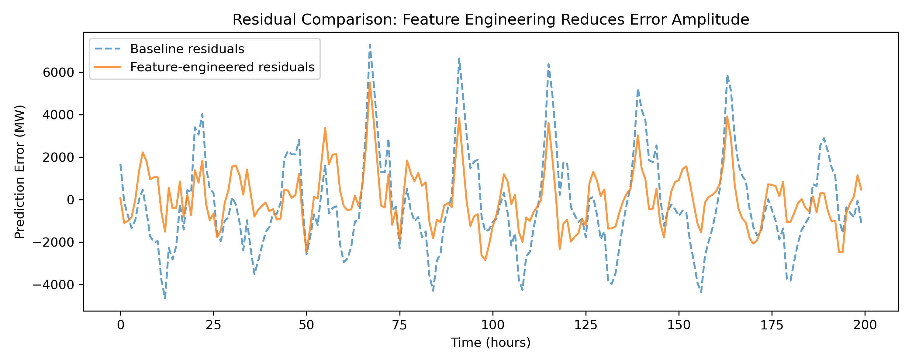

# Feature Engineering in Time Series Forecasting
**An Empirical Study Using German Electricity Load Data**

[](https://doi.org/10.14293/PR2199.002316.v1)
[](https://www.python.org/)

This repository contains the official implementation and code for the paper **"Feature Engineering in Time Series Forecasting: An Empirical Study Using German Electricity Load Data"**.

## 📄 Abstract
Feature engineering is a crucial element in Time Series Forecasting.Features can be designed to capture how patterns, trends, and seasonalityevolve over time. The following sections introduce practical techniquesinspired by calendar information and Fourier terms: lag features, rollingand seasonal window aggregations, exponentially weighted moving averages,and temporal embeddings. It also shows common issues arising,such as data leakage, and clarifies why well-defined forecast horizons areso important. Finally, an experimental illustration using German electricityload data demonstrates the importance of Feature Engineering inforecasting performance on real-world time series. The aim is to give anintuitive and accessible overview that helps practitioners turn time seriesinto richer, more informative inputs for their forecasting models.

## 📊 Key Findings
* **Dataset:** Analyzed German electricity consumption data.
* **Methodology:** Comparative analysis of classical machine learning models with extensive feature engineering.
## 📈 Results
The plot below demonstrates the effectiveness of our feature engineering approach. The orange line (our model) shows significantly lower error amplitude compared to the baseline model (blue dashed line), particularly during high-variance periods.



*Figure 1: Residual comparison over 200 hours. The feature-engineered model consistently achieves lower prediction error (MW) than the baseline.*
## 🚀 Installation & Usage

### Prerequisites

To run the experiments and reproduce the results, you will need:

* Python 3.x (3.8 or later recommended)
* The following Python libraries:
  * `pandas`
  * `numpy`
  * `scikit-learn`
  * `matplotlib`
  * `requests`  <!-- for downloading the OPSD dataset -->


1. Clone the repository:
   ```bash
   git clone [https://github.com/skarmaker-tuc/german-electricity-load-forecasting.git](https://github.com/skarmaker-tuc/german-electricity-load-forecasting.git)

## 🔗 Citation
If you use this code or our findings in your research, please cite the following paper:

```bibtex
@article{GermanLoadForecasting2025,
  title   = {Feature Engineering in Time Series Forecasting: An Empirical Study Using German Electricity Load Data},
  author  = {YourLastName, YourFirstName},
  journal = {ScienceOpen Preprints},
  year    = {2025},
  month   = {Nov},
  doi     = {10.14293/PR2199.002316.v1},
  url     = {[https://doi.org/10.14293/PR2199.002316.v1](https://doi.org/10.14293/PR2199.002316.v1)}
}

## 📚 Reference

This implementation follows the feature engineering principles presented in:

* Joseph, M. *Modern Time Series Forecasting with Python*. Packt Publishing, 2022,  
  Chapter 6: Feature Engineering for Time Series Forecasting.
